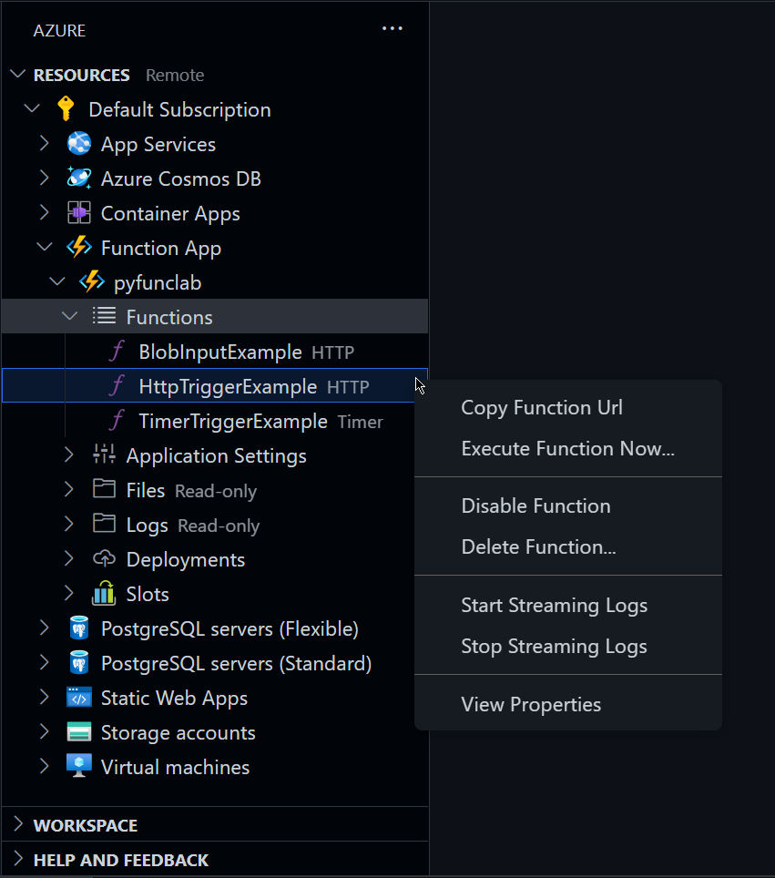

# Azure Functions Example

This repository contains a simple Function App written in Python and instructions on how to run it locally or deploy it to Azure using Visual Studio Code.

## Overview

The Function App showcases the [Python V2 programming model](https://learn.microsoft.com/en-us/azure/azure-functions/functions-reference-python?tabs=wsgi%2Capplication-level&pivots=python-mode-decorators) and contains three different functions:

1. An HTTP triggered function called `HttpTriggerExample` that returns jokes in JSON format using the [pyjokes](https://pypi.org/project/pyjokes/) package.

2. A function named `TimerTriggerExample` which runs on schedule.

3. `BlobInputExample`, another HTTP triggered function that reads a JSON file stored in Blob Storage via the Blob Input Binding.

More examples of triggers and bindings can be found in the [official documentation](https://learn.microsoft.com/en-us/azure/azure-functions/functions-bindings-triggers-python).

## Deploying to Azure

To deploy this application to Azure using Visual Studio Code, you should have installed the [Azure Account](https://marketplace.visualstudio.com/items?itemName=ms-vscode.azure-account), [Azure Resources](https://marketplace.visualstudio.com/items?itemName=ms-azuretools.vscode-azureresourcegroups), [Azure Functions](https://marketplace.visualstudio.com/items?itemName=ms-azuretools.vscode-azurefunctions), and [Azure Storage](https://marketplace.visualstudio.com/items?itemName=ms-azuretools.vscode-azurestorage) extensions.

Open the command palette by pressing `F1`, then search and select the following commands. When asked, choose the appropriate options (like the name of existing resources or the location you want to create new ones).

1. `Azure: Sign In`.

2. `Azure Storage: Create Storage Account...`. Use the Visual Studio Code extensions mentioned above to create a new container named `files` and a `settings.json` blob inside of it.

3. `Azure Functions: Set AzureWebJobsStorage...`. Pick the Storage Account you created previously.

4. `Azure Functions: Create Function App in Azure...`.

5. `Azure Functions: Add New Setting...`. Set `AzureWebJobsFeatureFlags` equal to `EnableWorkerIndexing`.

6. `Azure Functions: Deploy to Function App`. Pick the Function App you just created.

Now you should be able to copy a function's URL or execute it by browsing your Azure resources and right-clicking the function's name.

## Cleaning up

You should have two new resource groups: one for the Storage Account; and one for the Function App and its associated resources. Execute the `Azure: Delete Resource Group...` command to clean up.
